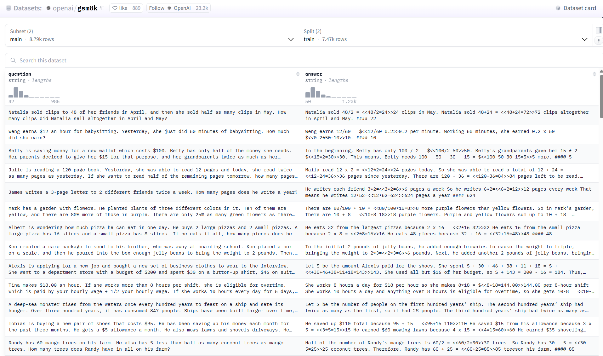

# GRPO - Online RL 实践
针对分组相对策略优化（GRPO）——一种主流的在线强化学习方法。

如你所忆，在线强化学习旨在让模型**自主探索更优回复**。

在本实验中，我们将首先**策划一组数学题目，**（GSM8K数据集，下图）将其输入当前语言模型，并让模型**生成多条回复；**随后设计一个**可验证奖励函数**，用于**检验回复是否与标准答案一致**；由此获得〈提示，回复，奖励〉三元组，并利用 **GRPO** 更新语言模型。接下来让我们在代码中完整体验。




## 目录与文件说明

- **在线强化学习（Online RL）实践.md**：本文件，讲解 GRPO 在线强化学习实践流程与代码片段。
- **Lesson_7.ipynb**：与本文配套的可运行 Notebook，按单元格逐步复现实验流程。
- **helper.py**：实验用工具函数集合，供本文与 Notebook 直接引用，包含：
  - `generate_responses(model, tokenizer, ...)`：使用分词器的 chat template 组织对话并生成模型回复；支持传入完整 `messages`。
  - `test_model_with_questions(model, tokenizer, questions, ...)`：批量测试若干题目，打印输入与输出，便于快速检查模型行为。
  - `load_model_and_tokenizer(model_name, use_gpu=False)`：加载 Causal LM 与分词器，必要时补充 `chat_template` 与 `pad_token`，并根据是否使用 GPU 将模型放置到对应设备。
  - `display_dataset(dataset)`：将含 `messages` 结构的数据集的前若干条以表格形式展示，便于快速浏览样例。
- **requirements.txt**：实验依赖列表。建议在该目录下执行：


快速开始：

1. 在当前目录安装依赖（见上）。
2. 准备可用的模型权重路径，或直接使用 HuggingFace 模型名称（如文中示例）。
3. 选择使用 `Lesson_7.ipynb` 逐步运行，或在 Python 环境中复用本文代码片段并从 `helper.py` 导入函数。


  


与往常一样，第一步是安装库函数并导入所需库。

安装库函数
```
pip install -r requirements.txt
```

导入所需库

```
import torch
from transformers import TrainingArguments, AutoTokenizer, AutoModelForCausalLM
from trl import GRPOTrainer, GRPOConfig
from datasets import load_dataset, Dataset
from helper import generate_responses, test_model_with_questions, load_model_and_tokenizer
import re
import pandas as pd
from tqdm import tqdm
```

此处与 DPO/SFT 类似，区别在于我们使用 HuggingFace 的 TRL 库中的 GRPOTrainer 与 GRPOConfig_来配置 GRPO 训练环境.

不同于前两节仅用少量示例提示测试，对于数学的评估数据集，本节将_使用 GSM8K 数学评测集_。首先设置 `use_gpu=False`；若在本机 GPU 上运行，可改为 `True`。还需设定系统提示（persistent prompt）：

```
USE_GPU = False

SYSTEM_PROMPT = (
    "You are a helpful assistant that solves problems step-by-step. "
    "Always include the final numeric answer inside \\boxed{}."
) 
```

> “你是一位乐于助人的助手，请逐步解题，并在最后用 \boxed{} 给出最终数值答案。”

该提示至关重要，可确保模型输出结构化，便于后续提取与比对。

接下来定义_奖励函数_，这可能是有用且重要的适用于两种培训，使用o_RL_ 与 _使用GSM8K 评估_ 。需要模型生成的`completions`或者生成结果和`ground_truth`，所以我们在这里要做的是：我们首次尝试做正则表达式网格，去捕获盒内的内容，正如我们提供的那样，在系统提示的指令中。在我们看到所有的`matches`，我们就拿到`contents` 和阿尔法退出模型。如果没有匹配，我们就让模型的输出在这里为空。接下来我们就直接比较一下具有基本事实的内容

```
def reward_func(completions, ground_truth, **kwargs):
    # Regular expression to capture content inside \boxed{}去捕获盒内的内容的正则表达式
    matches = [re.search(r"\\boxed\{(.*?)\}", completion[0]['content']) for completion in completions]
    contents = [match.group(1) if match else "" for match in matches]
    # Reward 1 if the content is the same as the ground truth, 0 otherwise
    return [1.0 if c == gt else 0.0 for c, gt in zip(contents, ground_truth)]
```

具体步骤：

1. **正则匹配**提取 `\boxed{}` 中的内容；
    
2. 若匹配成功，取首项并去除字母；
    
3. 若无匹配，则置输出为空。
    

随后直接比对提取结果与标准答案，这是一种二元的奖励函数：

- 一致 → 奖励 = 1
    
- 不一致 → 奖励 = 0
    

先测试奖励函数行为：

- **正例**预测：`\boxed{72}`，GT=72 → 奖励 = 1
    
- **负例**预测：`\boxed{71}`，GT=72 → 奖励 = 0
```
sample_pred = [[{"role": "assistant", 
                 "content": r"...Calculating the answer. \boxed{72}"}]]
ground_truth = ["72"]
reward = reward_func(sample_pred, ground_truth)
print(f"Positive Sample Reward: {reward}")

sample_pred = [[{"role": "assistant", 
                 "content": r"...Calculating the answer \boxed{71}"}]]
ground_truth = ["72"]
reward = reward_func(sample_pred, ground_truth)
print(f"Negative Sample Reward: {reward}")
```

## 加载评估数据集

从 **OpenAI GSM8K** 加载 **测试集**（test split）为加速演示，仅取**前 5 条样本**，并将 `test_size` 设为 5。该数据集总计包括1319条数据。

数据集包含：

- **question**：题干
    
- **answer**：原答案（含推理与最终数字）
    

需进一步提取答案中的数字作为 ground truth。

```
data_num = 5
eval_dataset = load_dataset("openai/gsm8k", "main")["test"].select(range(data_num))
sample_df = eval_dataset.to_pandas()
display(sample_df)
```

如果我们需要进行随机样本的选取，可以使用一下代码：
```
# Random select 20 example as the evaluate dataset

# Define the number of examples to randomly select
num_examples_to_select = 20

# Load the full test dataset
full_test_dataset = load_dataset("openai/gsm8k", "main")["test"]

# Randomly select 20 examples
# You can use the 'shuffle' method and then 'select' the first N examples
eval_dataset = full_test_dataset.shuffle(seed=42).select(range(num_examples_to_select)) # Using a seed for reproducibility

# Convert the selected dataset to a Pandas DataFrame for display or further use
eval_df = eval_dataset_random_20.to_pandas()

# Display the head of the DataFrame to see the selected examples
print(f"Randomly selected {num_examples_to_select} examples for evaluation:")
display(eval_df)
```

---

## 数据后处理

定义后处理函数：

- 利用 `####` 分隔符提取最终数字；
    
- 构造提示：将系统提示与问题拼接。
    

后处理后数据集仅含两列：

- **ground_truth**：标准答案数字
    
- **prompt**：系统提示 + 问题
```  
def post_processing(example):
    match = re.search(r"####\s*(-?\d+)", example["answer"])
    example["ground_truth"] = match.group(1) if match else None
    example["prompt"] = [
        {"role": "system", "content": SYSTEM_PROMPT},
        {"role": "user", "content": example["question"]}
    ]
    return example
eval_dataset = eval_dataset.map(post_processing).remove_columns(["question", "answer"])

sample_df = eval_dataset.select(range(5)).to_pandas()
display(sample_df)
```
---

## 模型加载与初次评估

加载 **Qwen2.5-0.5B-Instruct** 模型，
```
model, tokenizer = load_model_and_tokenizer("./models/Qwen/Qwen2.5-0.5B-Instruct", USE_GPU)

# Store predictions and ground truths
all_preds = []
all_labels = []

for example in tqdm(eval_dataset):
    input_prompt = example["prompt"]
    ground_truth = example["ground_truth"]
    # Run the model to generate an answer
    with torch.no_grad():
        response = generate_responses(model, tokenizer, 
                                      full_message = input_prompt) 
    all_preds.append([{"role": "assistant", "content": response}])
    all_labels.append(ground_truth)
    print(response)
    print("Ground truth: ", ground_truth)

# 3. Evaluate using reward_func
rewards = reward_func(all_preds, all_labels)

# 4. Report accuracy
accuracy = sum(rewards) / len(rewards)
print(f"Evaluation Accuracy: {accuracy:.2%}")
del model, tokenizer
```
在 5 条 GSM8K 测试样本上评估：

- 初始化空列表存储预测与标签；
    
- 调用 `generate_response` 生成回复；
    
- 利用奖励函数计算准确率。
    

---

## 评估结果（5 条示例）

- 第 1 条：无 `\boxed{}` → 不匹配
    
- 第 2 条：`\boxed{3}` vs GT=3 → 匹配
    
- 第 3 条：未完成（token 限制）→ 不匹配
    
- 第 4 条：`\boxed{180}` vs GT=… → 不匹配
    
- 第 5 条：未完成 → 不匹配
    

**准确率：20%（1/5）**

建议：

- 提高 `max_new_tokens`；
    
- 在完整测试集上评估以减少方差。
    

---

## 训练阶段

完成评估后，进入训练流程：

1. **加载训练集**：再次取自 GSM8K 的 train split，应用相同后处理。
    

若无 GPU，仅取**前 10 条**样本加速。
```
dataset = load_dataset("openai/gsm8k", "main")
train_dataset = dataset["train"]
 
# Apply to dataset
train_dataset = train_dataset.map(post_processing)
train_dataset = train_dataset.remove_columns(["question", "answer"])
if not USE_GPU:
    train_dataset = train_dataset.select(range(10))
print(train_dataset[0])
```
---

## 配置 GRPO 训练

设置 **GRPOConfig** 超参数：

- `per_device_train_batch_size`
    
- `num_epochs`
    
- `learning_rate`
    
- `logging_steps`
    
- **关键参数**：`num_generations=4`（同一提示生成 4 条回复，可设为 64/128 以提升多样性）
```
config = GRPOConfig(
    per_device_train_batch_size=1,
    gradient_accumulation_steps=8,
    num_generations=4, # Can set as high as 64 or 128
    num_train_epochs=1,
    learning_rate=5e-6,
    logging_steps=2,
    no_cuda= not USE_GPU     # keeps the whole run on CPU, incl. MPS
)
```

---

## 启动训练

由于 0.5B 模型在 CPU 上训练极慢，

使用更小的 SmolLM2-135M-Instruct 模型加速演示。

将 **模型、配置、奖励函数、训练集** 传入 `GRPOTrainer` 并启动训练。

训练过程已加速剪辑。
```
## If this block hangs or the kernel restarts during training, please skip loading the previous 0.5B model for evaluation

model, tokenizer = load_model_and_tokenizer("./models/HuggingFaceTB/SmolLM2-135M-Instruct", USE_GPU)

grpo_trainer = GRPOTrainer(
    model=model,
    args=config,
    reward_funcs=reward_func,
    train_dataset=train_dataset
)

grpo_trainer.train()
```
---

## 训练完成与现象

训练 loss 始终为 0：

- 小模型几乎无法答对 → 相对奖励全为 0。
    

若换用 **Qwen2.5B** 等更大模型，将观察到有意义的 loss 与提升。如果想使用已经微调好的 Qwen2.5B 模型，可以在 [Hugging Face - banghua](https://huggingface.co/banghua) 下载

---

## 全量训练模型评估

加载此前用 **GPU + 更大资源 + 微调配置** 训练的 Qwen 模型：

- 依次生成 5 条回复并比对 GT
    
- 第 1 条：`\boxed{20}` vs GT=18 → 不匹配
    
- 第 2 条：`\boxed{3}` vs GT=3 → 匹配
    
- 第 3 条：未完成 → 不匹配
    
- 第 4 条：`\boxed{540}` vs GT=540 → 匹配
    
- 第 5 条：`\boxed{40}` vs GT=20 → 不匹配
    

**准确率：40%（2/5）**

---

## 结论与建议

  

- 若需 严谨对比，请在 **完整 GSM8K 测试集** 上运行评估。
    
- 上述结果来自 **GPU 训练的 Qwen 模型**（配置略有差异）。
    
- 将 `fully_trained_qwen` 设为 `False` 即可查看 **小模型 + 小数据集** 的 GRPO 结果，适合有限算力场景。

```
#测试代码
fully_trained_qwen = True
if fully_trained_qwen:
    model, tokenizer = load_model_and_tokenizer("./models/banghua/Qwen2.5-0.5B-GRPO", 
                                            USE_GPU)
else:
    model = grpo_trainer.model

# Store predictions and ground truths
all_preds = []
all_labels = []

for example in tqdm(eval_dataset):
    input_prompt = example["prompt"]
    ground_truth = example["ground_truth"]
    # Run the model to generate an answer
    with torch.no_grad():
        response = generate_responses(model, tokenizer, 
                                      full_message = input_prompt) 
    all_preds.append([{"role": "assistant", "content": response}])
    all_labels.append(ground_truth)
    print(response)
    print("Ground truth: ", ground_truth)

# 3. Evaluate using reward_func
rewards = reward_func(all_preds, all_labels)

# 4. Report accuracy
accuracy = sum(rewards) / len(rewards)
print(f"Evaluation Accuracy: {accuracy:.2%}")
```

## 实验探索与思考
1. 本实验所用的reward function是二元奖励函数（即答案对了就是1分，答案错了就是0分），我们是否能够优化中间步骤的计算，融合CoT，帮助模型进行中间运算步骤的准确性。
2. 在本实验过程中，我们使用前5个数据进行eval： 模型的正确率从20%提升到到40%，就是从答对1个，到答对2个。这是否是属于偶然误差？
   > 我们在这里随机选取20个test集里面的数据（`shuffle(seed=42)`）：模型的正确从55%降低到50%。这个好像微调后似乎还起了少许副作用。
3. 我们发现有些output_token似乎太小，有几题模型都还没有到最后一步输出，中间就被截断了。
    > 我们在`helper.py`中默认最大输出的token数是300，如果想扩大token数，可以在`Lesson_7.ipynb`文件中将 `generate_responses`函数加入`max_new_tokens`参数，并进行修改，例如变成1000。


## 本节总结

本节课完整展示了：

1. **构建数学评估数据集**

2. **设计可验证奖励函数**

3. **基于现有指令模型进行 GRPO 训练**