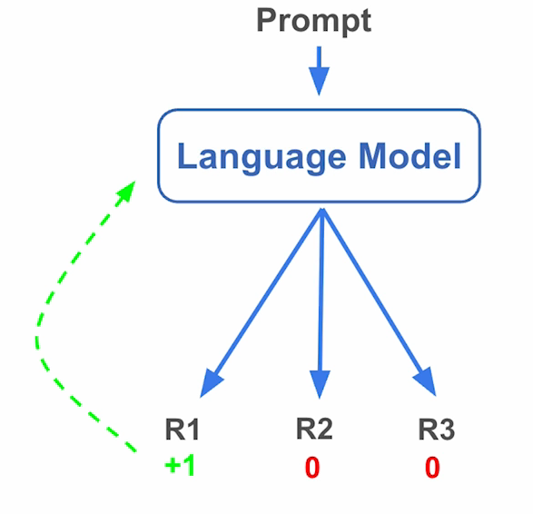
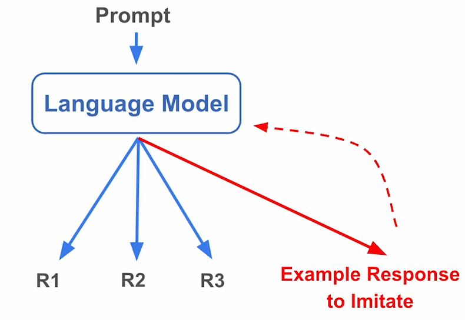

# 课程总结

## 大语言模型训练后优化方法比较

| 方法                     | 原理                                       | 优势                                         | 劣势                                                  |
| ------------------------ | ------------------------------------------ | -------------------------------------------- | ----------------------------------------------------- |
| 监督微调 (SFT)           | 通过最大化示例回答的概率来模仿目标响应模式 | 1.实现简单 2.可快速启动模型新行为       | 可能降低训练数据未涵盖任务的性能                      |
| 在线强化学习 (Online RL) | 通过最大化回答的奖励函数进行优化           | 提升模型能力的同时在未见任务上性能下降较少   | 1.实现复杂度最高 2.需要精心设计奖励函数          |
| 直接偏好优化 (DPO)       | 通过对比学习鼓励优质回答/抑制劣质回答      | 1.有效修正错误行为 2.针对性提升特定能力 | 1.可能出现过拟合 2.实现复杂度介于SFT和在线RL之间 |

---

## 性能保持性分析

> 在线强化学习为何比SFT更少降低性能？

**核心机制差异：**

- **在线强化学习(OnlineRL）**：

  模型生成多组回答(R1,R2,R3)→获取奖励信号→在模型**原生能力空间**内调整权重→ 保持模型生成分布稳定性

  
- **监督微调（SFT）**：

  
- 要求模仿的示例答案可能与模型*自然生成分布**存在根本差异→ 强制模型偏离原始能力空间→权重发生非必要改变

---

> 本节课程到此结束，期待您未来创造出突破性的成果！
